# DX7-IIFD repair, May 2022

I got a heavily damaged DX7-IIFD which suffered from a chronically corrupted memory and inability to save to SRAM despite having a new battery, lack of velocity or aftertouch response and a flickering display.

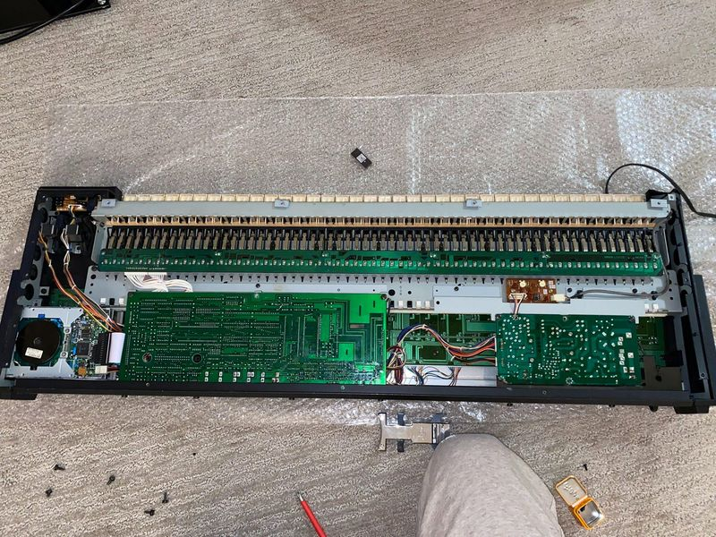

## Velocity / Aftertouch

To date, including this DX7-II, I've worked on six of these units (some IID, some IIFD) but four of the ones I've encountered had the same issue of no aftertouch response and the keyboard always reponds at maximum velocity. Since the aftertouch can take a good amount of force to activate, and must be programmed into a patch, it's easy to check velocity and aftertouch either by watching MIDI messages (MIDI-OX set to "Decimal" view mode is good for this). If the unit is equipped with firmware 1.6 or later, entering the test mode by pressing and holding the **EDIT** button then both the **16** & **32** buttons. Pressing **9** after the test screen loads will load the aftertouch test. Please note entering test mode will wipe the synth's internal memory, so be sure to have your patches and settings backed up if you do that.

On this synthesizer, the PCB's are mounted to the chassis in such a way that a shock to the chassis can easily result in cracked PCB's. In fact, a small corner of my power supply board was missing: 

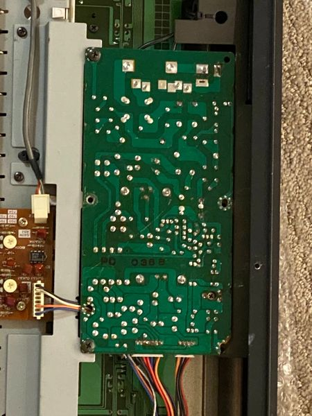

The aftertouch/velocity sensor board looks fine from the top...

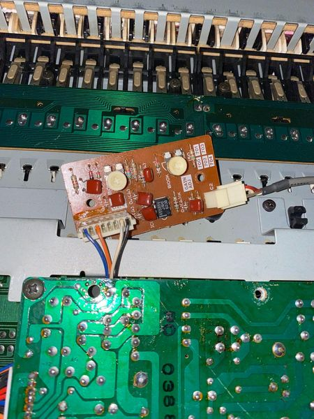

However upon removing the aftertouch/velocity sensor board the crack in the PCB can be seen.

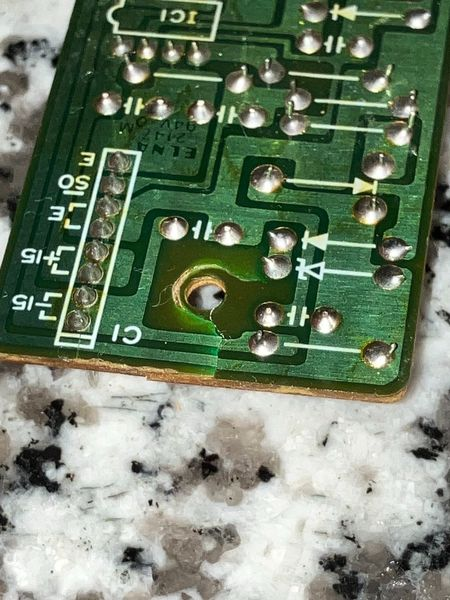

The crack can be seen directly beneath the screw hole. The solution to this problem is simple; since the crack is going directly across the two wide traces on the bottom of the PCB, those two tracks need to be jumped. Some 28 AWG wire is sufficient for this however I only had 20 AWG at the time I was fixing this. 

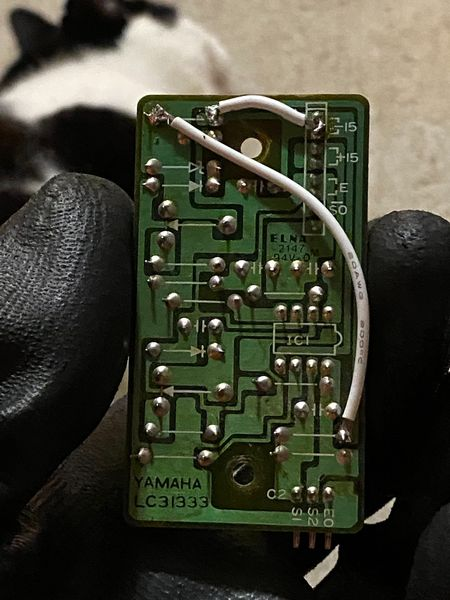

I wasn't sure if the thick 20 AWG wire would make contact with the chassis beneath the sensor board, so I cut out a piece of an anti-static bag to the shape of the sensor board, poked out holes for the screws and held it in place under the sensor board while re-attaching it to the chassis. Aftertouch and velocity works perfectly now. I would think if you used smaller wire that it wouldn't be necessary.

## Battery and corrupted memory

When the SRAM can't get enough power, the DX7's memory will be persistently corrupted. It turned out that there was a new battery measuring above 3V installed, but the synthesizer wasn't retaining any memory and was even corrupting data again if I loaded patches via MIDI.  Going into test mode showed a battery level of 5.0V which was unexpected (the display showed 50V NG, for whatever reason it displays the voltage without the decimal separator).

I noticed some burned flux and balled up solder on the bottom of the DM PCB where the battery is. Since the SRAM is powered by the battery, you can test the power at the SRAM by putting the negative (black) lead of your multimeter on the negative of the battery, and the positive lead to Vdd (pin 28) of one of the SRAM chips. On the DX7II's this is IC25 or IC26, a TC5564PL-15. Doing this showed 0.64v. I desoldered the battery and saw the pad for the battery positive was totally missing. I then reinstalled the battery but connected a small wire from the positive of the battery to the anode of D4. The SRAM then showed ~3V on the Vdd pin and the synth was able to retain memory.

Even though the convenience of a removable battery holder is very tempting, too many bad things can happen if the battery becomes loose. I've already been brought a few items for repair where a removable battery holder was installed, a battery came loose in transit and was banging around inside the unit, so I do recommend installing soldered type batteries and install them on repairs I do for customers.

## Power supply

Since I had the DX7-IIFD already torn apart, I wanted to rebuild the power supply for peace of mind since I did not want to diagnose a dead power supply later on, and the crucial components of the power supply do not inspire a lot of confidence. Additionally, for some reason USA units received a non-polarized and non-grounded AC cable which is also surprisingly thin. I was surprised by this since the other DX7II's I'd worked on had a much thicker and longer, but still non-grounded power cable. The cable was branded so I knew it was original. I wondered if ground loops would be an issue on the audio outputs, but it seemed unlikely if some units were shipping from the factory with a grounded power cable. I also did not want my IIFD to suffer any sort of avoidable static shock considering it was missing many screws and had some broken plastic around the chassis. The other major issue with non-polarized AC cables is that you might be switching the mains neutral and not the live which both leads to greater power consumption when idle but off and increased risk of electrical shock.

Given that certain regions received a grounded power cable, and some of them shared the exact same power supply board, I decided it'd be safest to put a nicer grounded power cable on. I chose a **Volex 17239 8 B1** which is Mouser P/N 686-17239. The original plastic clip that fit around the stock power cable's strain relief fit around the Volex cable fine to be sure it couldn't be pulled out too far, and twisting it tightly around the ferrite ring made it a tight enough fit that the cable is solidly in place.

Since the power supply is a single sided board, once you get the glue out of the way, the capacitors should fall right out once you adequately desolder them. I only needed a solder sucker to get all the electrolytics free without any trouble. The glue can be very annoying but if you hold the board firm so it doesn't flex, you can remove large chunks of it with some plain side cutters, enough to clear space to remove caps and get new ones in.

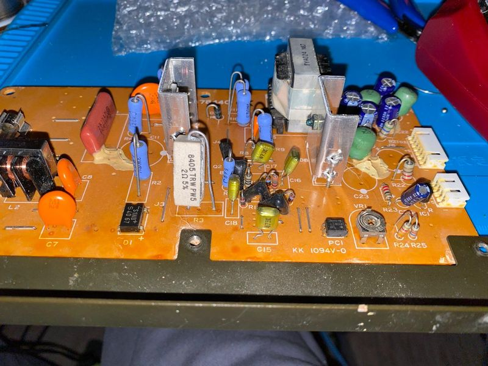 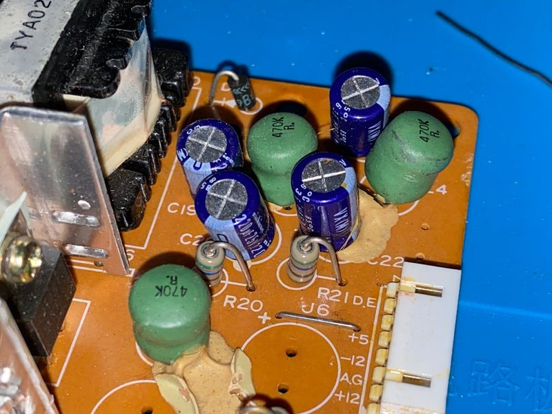 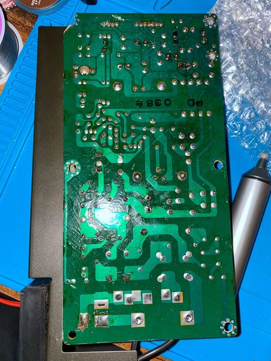

When choosing replacement capacitors, my concerns were long life, very high ripple current tolerance and small form factor since most are clustered together in one corner. I did not focus on anything like the lowest possible ESR etc since the originally used capacitors were of a much higher ESR than most you can buy now. I don't claim to understand the switching power supply design so well that I made the perfect choices for replacement capacitors, but that strategy for choosing components has not let me down. I chose Nichicon UCS for the capacitor on the primary side, Wurth WCAP-ATLI for the 220uf's (not a brand I am familiar with, but the ripple tolerance specs on these were excellent and the physical size was right), and CDE/IC KXM's for the filter caps on the 5V line (again, not a brand I usually use but the specs were excellent). I noticed the caps I pulled were 2200uf 16V, but the service manual says they will be 2200uf 10V. For capacitors like this the voltage is not always crucial as long as it is high enough above the voltage it will endure, and there are other times I've found caps rated higher than the service manual indicates they will be installed from the factory.

The capacitors I removed from the power board were mostly Nichicon VX(M), found in a lot of stuff from this era, though the two 2200uf's were YEC, not sure if they were stock since I wasn't sure if the solder looked like it was possibly replaced in the past, however these caps had an astoundingly high ESR of over 4 ohms so they had to go. The ESR on the VX(M)'s weren't terribly concerning, but the amount of voltage loss was higher than I'd like. In any case, they all got replaced.

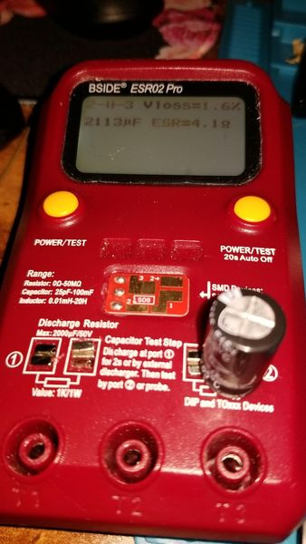 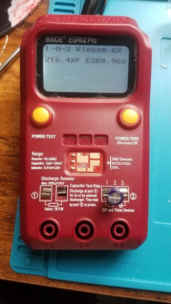 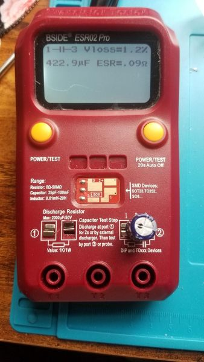 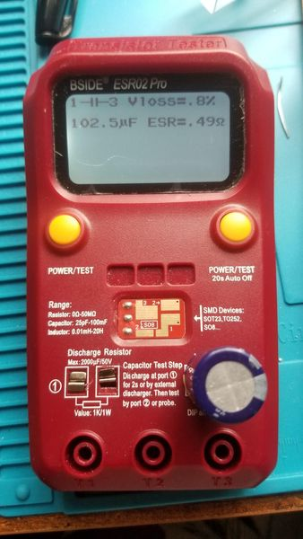

I would like to recommend you replace C25, a 1uf 50V electrolytic, with a MLCC. The lead spacing of this component is 5mm. A suitable replacement is **TDK FG28X5R1H105KRT06**. C25 is a bypass capacitor - its only purpose is to filter out high frequency components generated in the power supply from the power outputs the go to the rest of the synthesizer. MLCC's are vastly superior to electrolytics for this specific purpose. I've been replacing a lot of small bypass capacitors in my own gear with X5R dielectric MLCC and have had great results, especially in simpler power supplies where it may be the only thing removing a large component of noise from the power signal. 

After installing all the capacitors, checking everything, cleaning it, taking a break overnight and checking and cleaning it again, I installed the new AC cable being sure to put the live wire on the switched side, and the ground wire reached to a nearby ground on the power board which also connected to a chassis ground so I used that space and double checked the ground wire was very secure. Once I reattached it to the IIFD and powered it on, I left it running while receiving MIDI signals for ~6 hours, just to be sure everything was working great.

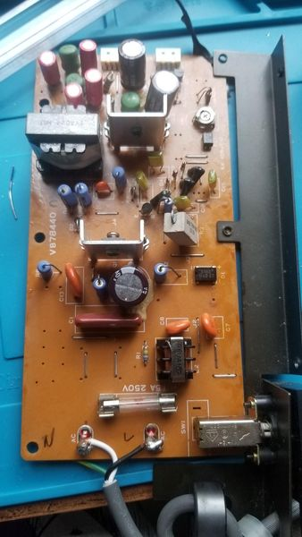 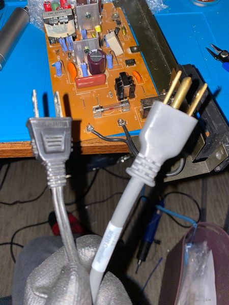

You can see the new cable inspires a lot more confidence. There won't be any doubt as to whether it's original or not, since it's dated February 2022.

## Display

I did not document this in any special way since it simply turned out to be that one of the wires powering the backlight was coming loose, and was fine after re-soldering.  You do have to remove the keybed to get to the display wires, as well as the floppy drive if you have the FD model. Note the bracket for the floppy drive scratches against the back of part of the button/input PCB. I put a piece of electrical tape with a hole poked through it between the bracket and the PCB to prevent the PCB from further damage.

## USB Floppy Emulator install

Since the IIFD uses a very old style floppy drive with an unusual pinout, and larger than normal form factor, the screw holes don't line up with the holes on a Gotek and an additional mod is needed to relocated the disk change signal to pin 1. I had a Gotek with a damaged pin header I'd been saving for a project like this so I put it in. I found if you used the slightly larger screws to mount it, that were used on the original floppy drive, but don't screw them in all the way, they can hold the Gotek in place. It's surprisingly held in very securely like this and has never budged despite removing and replacing the USB stick frequently. 

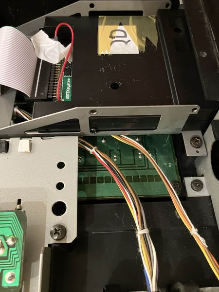